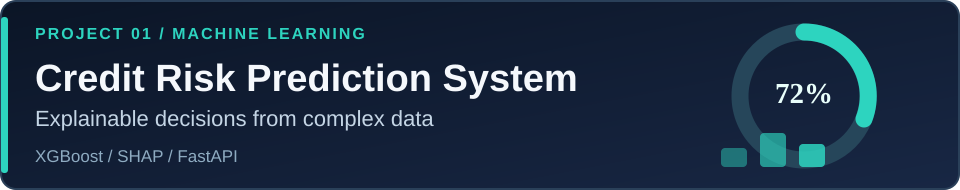
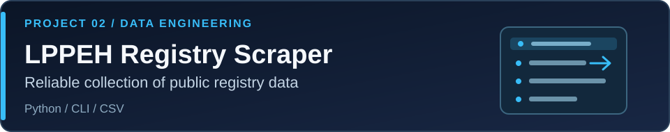
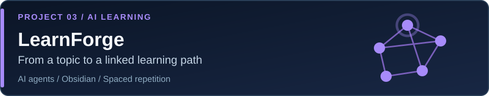
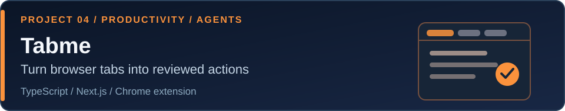

  

  <a href="https://www.linkedin.com/in/yoke-yau-lai-186a4327b/">LinkedIn</a> ·
  <a href="mailto:laiyokeyau@gmail.com">Email</a>

Data Science student building practical tools across machine learning, data engineering, and AI-powered applications. I enjoy turning complex workflows into useful, approachable software.

  
  
  
  
  

## Selected projects

XGBoost risk predictions with SHAP explanations, CSV batch processing, and a React interface.

A resumable Python CLI that validates registry responses, retries failures, and exports structured CSV data.

AI agents turn a topic into a learning path, connected notes, exercises, and spaced-repetition review.

A Chrome extension and web app suggest actions from open tabs for human review before any write.

Translate video content in a web app. [Try the live demo](https://vdeo-translator.vercel.app/).
